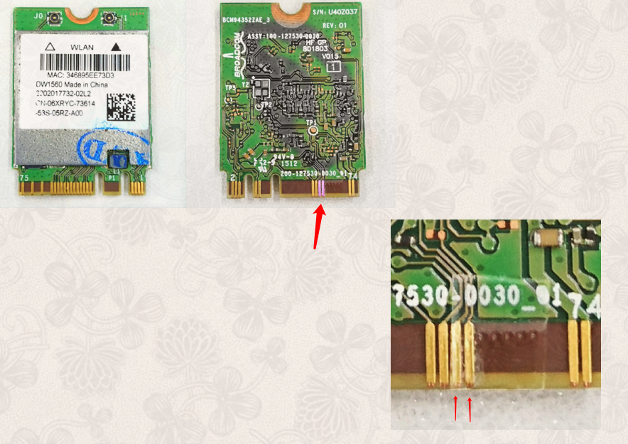

# Hackintosh-EFI-for-deskmini-310-i3-8100

<<<<<<< HEAD
EFI 用于 10.13.6，为本人折腾成果，目前我正在使用。

EFI_10.14 用于 10.14，来源于QQ群:580456695，我升级系统，所以没亲自测试。
=======
我这个 EFI 用于 10.13.6。在10.14可能会稍有区别（在10.14使用核显会更好，更兼容）
>>>>>>> 6f176a7da15d14c80fa3ab348043f5dc8750f5fb

deskmini 310 +i3-8100的hackintosh（黑苹果）efi 配置

参考： https://www.tonymacx86.com/threads/asrock-deskmini-310-com-issue.254724/

deskmini 110 可以看这个兄弟的：https://github.com/yunWJR/Hackintosh-deskmini-efi

# **重要提示**

黑苹果这个核显启动成功后，视频信号会从 DP 输出，hdmi会没信号，我被这个折腾了好久，以为自己玩坏了。

### 我的配置

- intel  i3 8100 盒装，使用原装风扇，静音。

- intel 760P 256G NVMe M.2 。看中5年质保，京东购入。

- Kingston Impact DDR4 2666 8G x 2 套装 。装机点亮后，直接工作在 2666，刚开始买的十铨，双通道有时无法开机，退了。

- 英睿达 BX500  120G SATA3 ，用于装 windows 10 打个游戏）

- LG 25um58-p 显示器，显示器没 DP 口，使用 绿联  PS176芯片（重要）的DP 转 hdmi 线连接，89元。25寸 21:9 超宽屏。刚开始买的是34寸款的，到货后发现实在太大，没拆就退了。后面经过比较，在 2560x1080 分辨率下这个25寸的屏幕，ppi 比 24寸的 1080p 屏幕更高，比27寸的2k屏幕都要高。 至于为什么没有选更大的，原因主要有一个：穷。了解到 OSX 对 2k 分辨率的缩放效果并不好，所以我直接放弃购买 2k 的屏幕，而 4k 似乎没有我买得起的超宽屏。目前这个显示器非常满意，没有双屏中间那个黑边。以后我还是会选择买超宽屏。	- LG 25um58-p 显示器，显示器没 DP 口，使用 绿联  PS176芯片（重要）的DP 转 hdmi 线连接，89元。25寸 21:9 超宽屏。刚开始买的
 #### EFI	
该文件夹下的默认`config.list`配置的是dp4K显示器输出。目前启动是在啰嗦模式（-v），去掉后我似乎启动不了，启动滚字母也还能接受，linux启动滚字幕我习惯好多年了。	
 ### 安装前设置	
###Bios Set:	
1. Load UEFI Defaults	
 2. Advanced	
    - CPU Configuration / Intel Virtualization Technology: Disabled	
    - Chipset Configuration	
        VT-d: Disabled	
        Onboard HD Audio: Enabled	
     - USB Configuration, XHCI Hand-off, Enabled	
    - Super IO Configuration, Serial Port, Disabled	
 3. Security	
Secure Boot, Disabled(by default)	
 ### 其他	
无线网卡是`DW1560`，某宝全新到手加接线和天线150RMB左右。收到后直接用透明胶屏蔽（贴住）两个针脚就可以使用了（不影响windows下使用）。使用我这个配置可以直接驱动wifi和蓝牙。这个网卡黑苹果用得多，不行就再搜索一下。	
 	
 参考：https://www.cnblogs.com/SemiconductorKING/p/7702410.html
